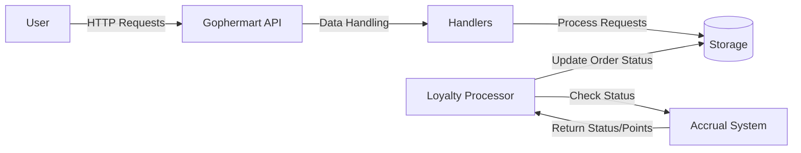
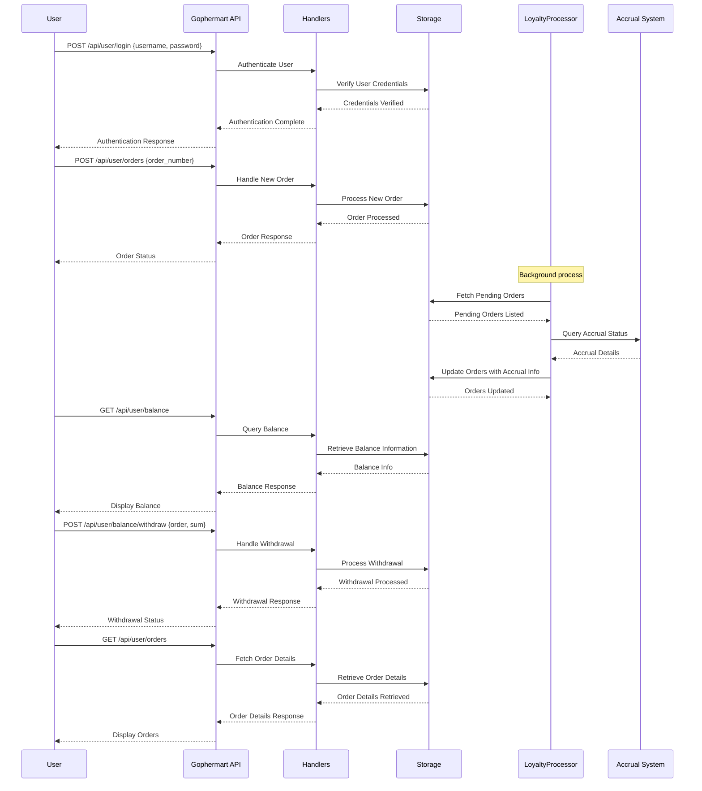

# gophermart

## Entity-Relationship Diagram (ERD)

### Entity-Relationship Diagram (ERD) Description

### Entities and Attributes

1. **Users**
    - `id`: Primary Key, Serial
    - `username`: VARCHAR(255), Unique, Not Null
    - `password_hash`: CHAR(60), Not Null

2. **Orders**
    - `id`: Primary Key, Serial
    - `user_id`: INT, Foreign Key (References Users.id)
    - `order_number`: VARCHAR(255), Unique, Not Null
    - `status`: ENUM('NEW', 'PROCESSING', 'INVALID', 'PROCESSED')
    - `accrual`: DECIMAL(10, 2), Default 0.00
    - `uploaded_at`: TIMESTAMP WITH TIME ZONE, Default CURRENT_TIMESTAMP

3. **Transactions**
    - `id`: Primary Key, Serial
    - `user_id`: INT, Foreign Key (References Users.id)
    - `type`: VARCHAR(10), Not Null -- 'accrual' or 'withdrawal'
    - `amount`: DECIMAL(10, 2), Not Null
    - `order_id`: INT
    - `created_at`: TIMESTAMP WITH TIME ZONE, Default CURRENT_TIMESTAMP

### Relationships

- **Users** to **Orders**: One-to-Many
    - One User can have multiple Orders.
    - Each Order belongs to exactly one User.

- **Users** to **Transactions**: One-to-Many
    - One User can have multiple Transactions.
    - Each Transaction belongs to exactly one User.

### System interaction flow diagram

### Sequence diagram

